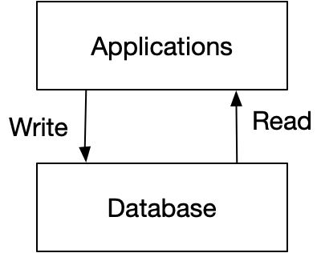
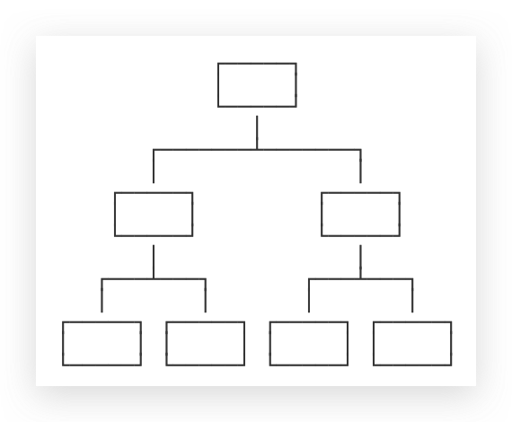

# 1-1 关系型数据库
为软件提供数据存储和查询功能的软件

# 为什么需要数据库？

因为应用程序需要保存用户的数据，比如Word需要把用户文档保存起来，以便下次继续编辑或者拷贝到另一台电脑。

但是，随着应用程序的功能越来越复杂，数据量越来越大，如何管理这些数据就成了大问题：
* 读写文件并解析出数据需要大量重复代码；
* 从成千上万的数据中快速查询出指定数据需要复杂的逻辑。

如果每个应用程序都各自写自己的读写数据的代码，一方面效率低，容易出错，另一方面，每个应用程序访问数据的接口都不相同，数据难以复用。

所以，数据库作为一种专门管理数据的软件就出现了。应用程序不需要自己管理数据，而是通过数据库软件提供的接口来读写数据。至于数据本身如何存储到文件，那是数据库软件的事情，应用程序自己并不关心：

# 存储模型—如何存储
数据库按照数据结构来组织、存储和管理数据，实际上，数据库一共有三种模型：

* 层次模型（结构固定），无法完整描述关系

  

* 网状模型（结构），无法灵活变动

  

* 关系模型，胜出

  

# SQL--如何使用

Structured Query Language

## DDL: Data Definition Language - 表格管理
DDL允许用户定义数据，即创建表、删除表、修改表结构这些操作。通常,DDL由数据库管理员执行

## DML: Data Manipulation Language— 数据增删改

DML为用户提供添加、删除、更新数据的能力，这些是应用程序对数据库的日常操作。

## DQL: Data Query Language—数据查询

DQL允许用户查询数据，这也是通常最频繁的数据库日常操作。

# 安装-Mac

* 安装-mysql `brew install mysql` 
	* 如果是已经安装过 `brew reinstall mysql`
* 服务状态管理：
  * `brew service list`
  * `brew  services start mysql`
  * `brew services stop mysql`
* 安装-客户端，DataGrip

参考资料:
[SQL教程 - 廖雪峰的官方网站](https://www.liaoxuefeng.com/wiki/1177760294764384)