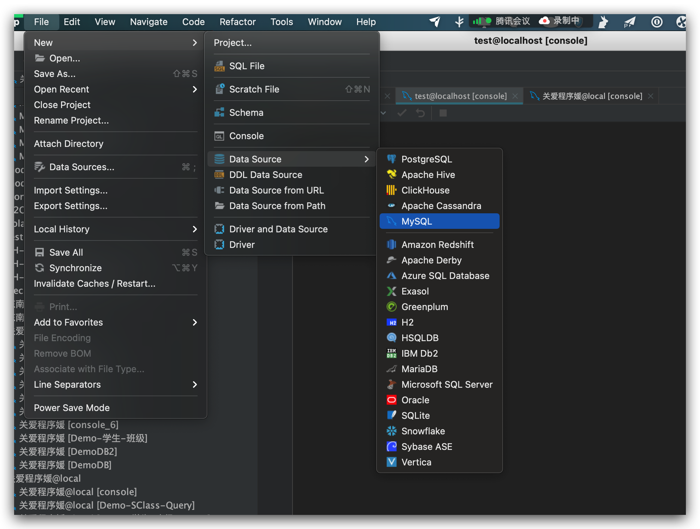

# Demo数据库

## 学生	

| sid  | name | sbirth     | ssex |
| ---- | ---- | ---------- | ---- |
| 1    | 赵雷 | 1990/1/1   | 男   |
| 2    | 钱电 | 1990/12/21 | 男   |
| 3    | 孙风 | 1990/5/20  | 男   |
| 4    | 李云 | 1990/8/6   | 男   |
| 5    | 周梅 | 1991/12/1  | 女   |
| 6    | 吴兰 | 1992/3/1   | 女   |
| 7    | 郑竹 | 1989/7/1   | 女   |
| 8    | 王菊 | 1990/1/20  | 女   |

## 课程 course

| cid  | cname | tid  |
| ---- | ----- | ---- |
| 1    | 语文  | 2    |
| 2    | 数学  | 1    |
| 3    | 外语  | 3    |

## 老师 teacher

| tid  | tname |
| ---- | ----- |
| 1    | 张三  |
| 2    | 李四  |
| 3    | 王五  |


## 成绩 sc

| cid  | sid  | score |
| ---- | ---- | ----- |
| 1    | 1    | 90    |
| 1    | 2    | 80    |
| 1    | 3    | 90    |
| 2    | 1    | 70    |
| 2    | 2    | 60    |
| 2    | 3    | 80    |
| 3    | 1    | 80    |
| 3    | 2    | 80    |
| 3    | 3    | 80    |
| 4    | 1    | 50    |
| 4    | 2    | 30    |
| 4    | 3    | 20    |
| 5    | 1    | 76    |
| 5    | 2    | 87    |
| 6    | 1    | 31    |
| 6    | 3    | 34    |
| 7    | 2    | 89    |
| 7    | 3    | 98    |

# datagrip 构建

## 连接数据库



## 创建一个数据库

```
	CREATE DATABASE IF NOT EXISTS demodb;
```


## 创建表格

```
use demodb;

create table student(sid int primary key auto_increment,
sname varchar(20),
sbirth date,
ssex enum('男','女'));


create table teacher(tid int primary key auto_increment,
tname varchar(20));


create table course(cid int primary key auto_increment,
cname varchar(20),
tid int,
foreign key(tid) references teacher(tid));

create table sc(sid int,
cid int,
score int);


```

## 插入数据

```

insert into student( sname, sbirth, ssex) values('赵雷','1990-01-01','男'),
	('钱电','1990-12-21','男'),
	('孙风','1990-05-20','男'),
	('李云','1990-08-06','男'),
	('周梅','1991-12-01','女'),
	('吴兰','1992-03-01','女'),
	('郑竹','1989-07-01','女'),
	('王菊','1990-01-20','女');


--
insert into teacher(tname) values('张三'),
		('李四'),
		('王五');


--
insert into course values(1,'语文',2),
			(2,'数学',1),
			(3,'英语',3);


--
insert into sc values(1,1,90),
			(1,2,80),
			(1,3,90),
			(2,1,70),
			(2,2,60),
			(2,3,80),
			(3,1,80),
			(3,2,80),
			(3,3,80),
			(4,1,50),
			(4,2,30),
			(4,3,20),
			(5,1,76),
			(5,2,87),
			(6,1,31),
			(6,3,34),
			(7,2,89),
			(7,3,98);

```


# SQL

### 基本操作

增删改查

| 动作 | SQL 关键词 |                                                         |
| ---- | ---------- | ------------------------------------------------------- |
| 增加 | Insert     | insert into course(cid, cname, tid) values(4,'语文',2); |
| 删除 | Delete     | delete  from course where  cid=4;                       |
| 修改 | Update     | update sc set  score = score+1 where sid=1 and cid=1;   |
| 查询 | Select     | select * from student where sid=1;                      |


## 高阶

### 连表 

查询学生1的所有课程的所有成绩

```
select 
	student.sid, sname, course.cname, sc.score
from student
join sc on sc.sid = student.sid
join course on course.cid=sc.cid
where sc.sid=1;
```


### 聚合

统计没门课程的平均分和最高分

```
select 
	course.cname, avg(sc.score) as 平均分,  max(sc.score) as 最高分 
from sc 
join course on sc.cid=course.cid 
group by course.cname;
```


# 参考

https://segmentfault.com/a/1190000022279128

https://www.liaoxuefeng.com/wiki/1177760294764384/1179610544539040

