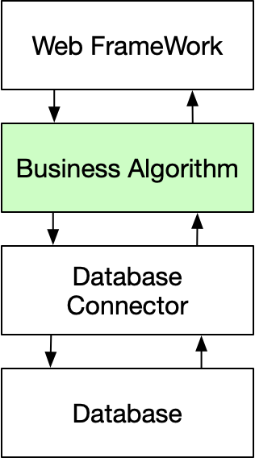

# 2-1 后端框架

用户看不到的，为前端提供业务处理功能的逻辑代码叫做后端，而为后端功能，提供一套模板规范的代码叫做后端框架。

## 接口的概念

前端，后端，数据库之间，通过接口实现相互调用，这里的接口（interface），定义为代码逻辑对外提供服务的入口。

用户使用软件，那么前端呈现的图形化界面就是接口，叫做 GUI（Graphical user interface）；如果是 一段代码 通过接口调用 另外一段代码，这种接口叫做API(Application programming interface)。

根据不同的场景，我们可能给API赋予不同的前缀。比如前段调用后端，相当于调用后端的API，一般走的是HTTP请求，所以我们把后端的API叫做HTTP接口；后端调用数据库，需要通过第三方的连接器（SDK）来调用，我们把这种代码叫做SDK接口。

## 为什么我们需要后端框架？

如果我们不需要后端框架，比如自己实现一个HTTP接口，当前端有调用过来，后端返回 “Hello World”。

那么我们需要写一个HTTP协议的监听的代码，数据包解析的代码，还要写一个多线程代码（多用户请求），还要考虑安全问题。。。

如果每一个接口都需要关注上述问题，那么每一份代码将会很复杂，而且容易出错，所以出现了统一封装的Web框架 ，让程序员在做Web接口的时候只需要关注自己的应用逻辑，而不需要重复大量的底层逻辑。

结合前面的数据库，那么用户可以非常明确的实现一个带有数据库功能的HTTP接口的应用代码，结构如下。

我们根据实际的开发经验，在后端框架上我们选择 Flask，在数据库连接器的三方库上我们选择 dataset 。

# 参考

http://docs.jinkan.org/docs/flask/

https://read.helloflask.com/

https://dataset.readthedocs.io/en/latest/quickstart.html

