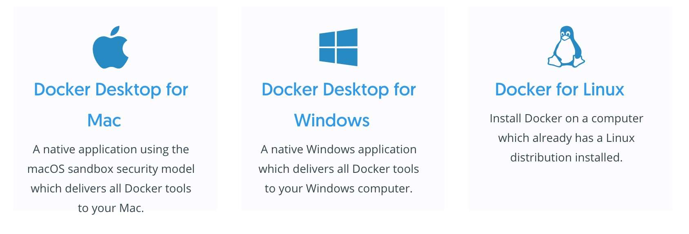
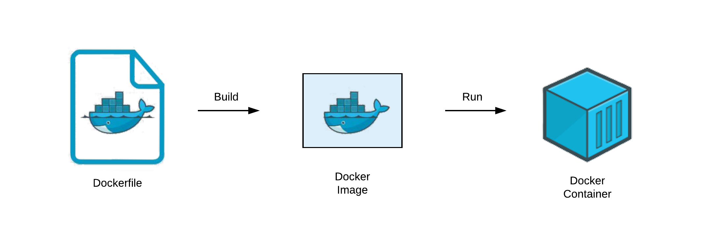

# Docker的开发实战


# 背景

自动化部署的两种方式：

1. 服务器端保持流程不变，将人工执行的命令行转化为代码
   1. 典型技术：Ansible
   2. 适用场景，复杂系统搭建，例如大数据分布式计算
2. 简化服务端的流程，让所有的应用用同一套部署流程
   1. 典型技术：Docker
   2. 适用场景，单一业务系统的搭建，例如笔记类应用后端


# Docker


* Docker is an open platform for developing, shipping, and running applications.

* 解决的问题：代码应用的部署问题，简化从研发到上线的流程

* 参考流程：软件发布流程

  * 研发--》代码包--》应用市场--》用户PC

    * 不同的操作系统需要对应不同的代码包
    * 但是基于Docker的应用，只需要一份代码，就可以兼容各类操作系统

    

# quick start 

苹果系统启动Ubuntu 环境

```
$ docker run -it ubuntu /bin/bash

$ uname -a
Linux d0071640a55e 4.19.121-linuxkit #1 SMP Tue Dec 1 17:50:32 UTC 2020 x86_64 x86_64 x86_64 GNU/Linux

```


# docker 容器 v.s 虚拟机


docker 容器和虚拟机二者都可以理解为一台基于实体机的虚拟小电脑，但是二者是有底层逻辑上的区别的：

* 虚拟机，从操作系统层面上进行切分
* docker容器，从应用层面上进行切分


# Docker整体架构


这个Docker架构无论是在本地的研发机器，还是服务器的远端，都是一样的架构，[原文参考](https://docs.docker.com/get-started/overview/)。

## Docker_Host

* Docker Host 是指部署有docker环境的硬件, 比如你的笔记本

* Docker Daemon

  * 这是一个监听程序，负责接收Client 给他的指令，来执行动作
  * 主要是对 Image 和 Container的进行操作

* Image

  * An *image* is a read-only template with instructions for creating a Docker container.

  * 相当于传统软件中的安装包，例如 wechat.dmg

  * 标识：

    * image name:
      * {image_name}:{tag}, 例如 python:3.8.5
    * image id
      * 随机字符串

  * 一个 Image 往往是基于另外一个Image之上做的一些定制

    * 例如 Python-3 的image 是基于 Ubuntu的Image

    

* Container

  * A container is a runnable instance of an image.

  * 相当于从软件包中解压安装出的软件，例如 wechat.app

  * 标识：

    * container name
      * 一般为随机字符串
    * container id
      * 随机字符串

    

## Registy

* A Docker *registry* stores Docker images.
* 相当于传统软件中的应用市场，例如 App Store
* DockerHub,https://hub.docker.com/
  * 一个发布 Image的市场，类似Github


## Client

* The Docker client (`docker`) is the primary way that many Docker users interact with Docker.
* [SDK API](https://docs.docker.com/engine/reference/commandline/cli/)
  * docker build, 创建新的Image
  * docker pull，拉取存在，Registy 的Image
  * [docker run](https://docs.docker.com/engine/reference/run/)， 基于某个Image 启动一个 Container 
  * [docker container](https://docs.docker.com/engine/reference/commandline/container/)
  * [docker images](https://docs.docker.com/engine/reference/commandline/images/)

# Docker 安装

* https://docs.docker.com/get-docker/




# DockerFile



A Dockerfile is simply a text-based script of instructions that is used to create a container image.

如何定义 [DockerFile](https://docs.docker.com/engine/reference/builder/)

常用命令：

* From

  * 指定基于哪个Image来构建上层代码， 例如  python:3.8.5

* WORKDIR

  * 程序代码的执行路径
    * python src/app.py
    * cd src && python app.py

* COPY

  * 将本地文件 copy 到镜像中，例如
    * COPY src /app/src

* RUN

  * 在容器中执行的命令, 例如

    * pip install -r requirements.txt

    

* CMD

  * 容器启动之后指定的命令，例如
    * `docker run -ti python:3.8.5 python`


# 实战-FlaskHello

* https://github.com/TechWifeCoding/DockerDemo
* Flask run
* 学习docker file

## 本机

### Image Buid

```
docker build -t flask-hello:v1 .
```

### Container Start

```
docker run -p 5000:5000  --name flask-hello-service flask-hello:v1
```

### Image Push

```

docker login
docker tag flask-hello:v1 clarkchenme/flask-hello:v1
docker push clarkchenme/flask-hello:v1

```


## 远端

47.242.108.129

### docker login?

如果是私有的 dockerhub repo 需要输入，如果是公有的就不需要了

### Image Pull

```
docker pull clarkchenme/flask-hello:v1
```

### Docker Run

```
CONTAINER_NAME=flask-hello
IMAGE_NAME=clarkchenme/flask-hello:v1

docker container stop $CONTAINER_NAME
docker container rm $CONTAINER_NAME
docker pull $IMAGE_NAME
docker rmi -f $(docker images|awk '/none/{print $3}')
docker run -p 5000:5000 -d  --name $CONTAINER_NAME $IMAGE_NAME 

```


# 实战-FlaskHello更新


## 本机

## 容器内调试

```
srcPath=`pwd`/src
docker run -p 5000:5000 -v $srcPath:/app/src -e FLASK_ENV=development --name flask-hello-service flask-hello:v1
```

* -v $srcPath:/app/src
* -e FLASK_ENV=development

### Image Buid

```
docker build -t flask-hello:v1 .
```

### Container Start

```
# 需要删除之前的Container
# 因为名字重复
docker container stop flask-hello-service
docker container rm flask-hello-service
docker run -p 5000:5000  --name flask-hello-service flask-hello:v1
```

## Image clean

```
# docker images|awk '/none/{print $3}'

docker rmi -f $(docker images|awk '/none/{print $3}')
```

### Image Push

```
# docker login
docker tag flask-hello:v1 clarkchenme/flask-hello:v1
docker push clarkchenme/flask-hello:v1

```


## 远端

流程同上


# Pros & Cons

Pros:

* 远端部署，命令固定，不需要考虑环境配置等问题

Cons:

* Docker 的学习有一定的学习成本


## Next

* 
* 